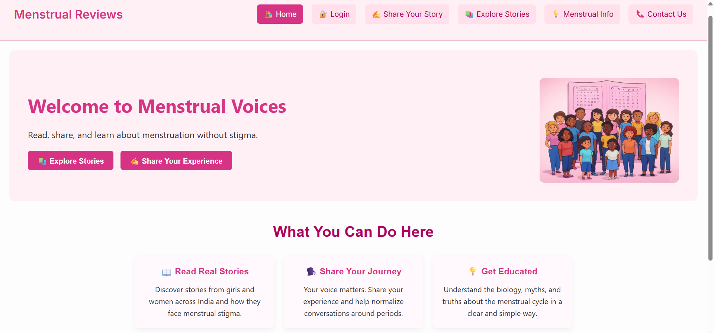
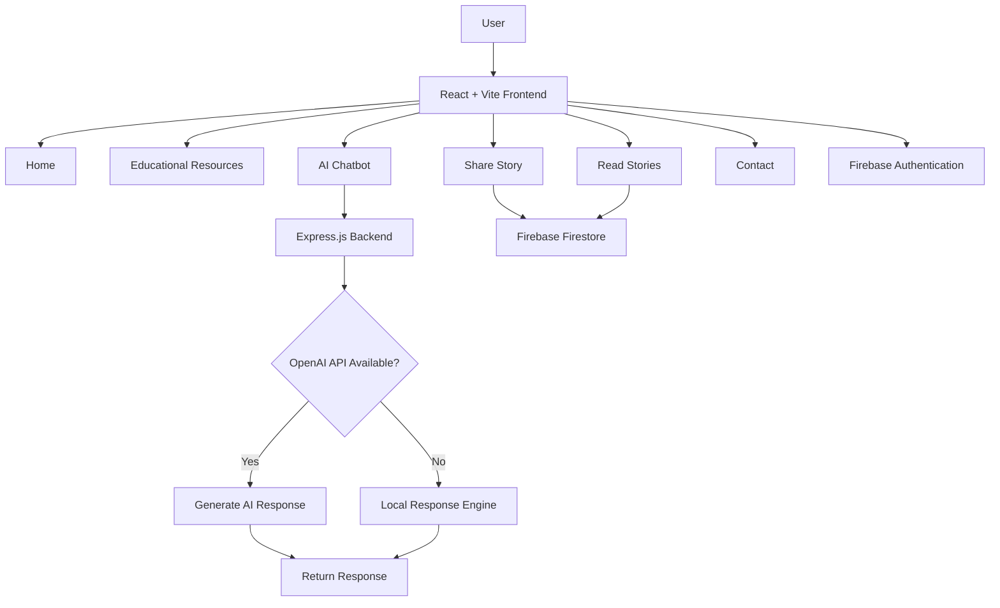
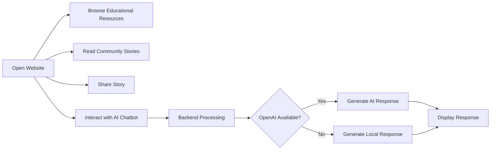
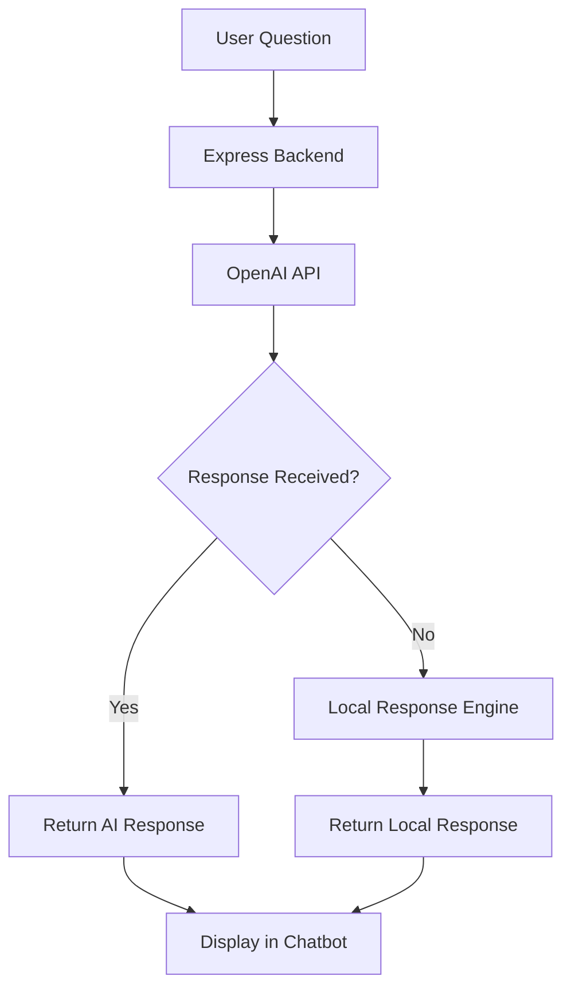
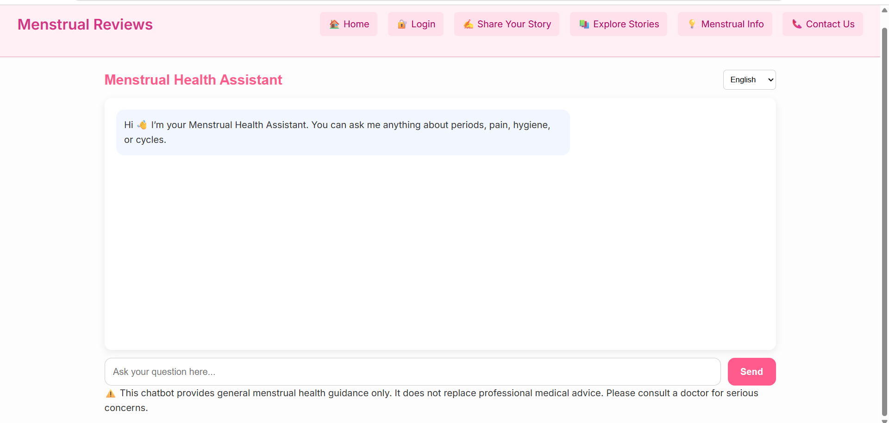

# 🌸 Menstrual Reviews

> **Promoting menstrual health awareness through education, community engagement, and AI-assisted guidance.**

<div align="center">


</div>

---

## 🌐 Live Demo

**Website:** https://menstrual-reviews-frontend.onrender.com/

---

## 🖼️ Project Preview

<p align="center">
    
</p>

---

## 📖 Table of Contents

- [Project Status](#-project-status)
- [Why Menstrual Reviews?](#-why-menstrual-reviews)
- [Project Overview](#-project-overview)
- [Objectives](#-objectives)
- [Key Features](#-key-features)
- [Technology Stack](#️-technology-stack)
- [System Architecture](#️-system-architecture)
- [Project Structure](#-project-structure)
- [Project Workflow](#-project-workflow)
- [Installation](#️-installation)
- [Running the Project](#️-running-the-project)
- [Project Screenshots](#-project-screenshots)
- [Future Enhancements](#-future-enhancements)
- [Contributing](#-contributing)
- [License](#-license)
- [Author](#-author)
- [Project Links](#-project-links)
- [Acknowledgements](#-acknowledgements)

---

## 📌 Project Status

| Attribute | Details |
|-----------|---------|
| **Project Name** | Menstrual Reviews |
| **Project Type** | Full-Stack Web Application |
| **Development Status** | ✅ Completed |
| **Frontend** | React + Vite |
| **Backend** | Node.js + Express.js |
| **Database** | Firebase Firestore |
| **Authentication** | Firebase Authentication |
| **AI Module** | OpenAI API + Local Response Engine |
| **Deployment** | Render |
| **Primary Language** | JavaScript |
| **Repository Owner** | Mansi Muneshwar |

> **Current Version:** Version 1.0

---

# 🌍 Why Menstrual Reviews?

Menstrual health is an essential aspect of overall well-being, yet discussions surrounding menstruation continue to be limited by social stigma, misinformation, and restricted access to reliable resources. Many individuals still hesitate to seek guidance or openly share their experiences, making it difficult to build awareness and supportive communities.

**Menstrual Reviews** was created with the vision of providing a safe, informative, and accessible digital platform where users can learn about menstrual health, share experiences anonymously, and receive general guidance through an AI-assisted multilingual chatbot.

Rather than focusing solely on symptom-related information, the platform encourages awareness, education, and community engagement. By combining modern web technologies with an intelligent conversational assistant, Menstrual Reviews aims to make trustworthy menstrual health information more approachable and easily accessible.

The project demonstrates how technology can be used to address real-world health awareness challenges while maintaining a simple, intuitive, and user-friendly experience.

---

# 📖 Project Overview

**Menstrual Reviews** is a full-stack web application developed to promote menstrual health awareness through education, community interaction, and AI-assisted guidance.

The platform enables users to:

- Learn about menstrual health through curated educational resources.
- Share personal experiences anonymously in a safe and supportive environment.
- Read stories contributed by other users to encourage awareness and reduce stigma.
- Interact with an AI-powered multilingual chatbot for general menstrual health guidance.
- Access important information using a clean, responsive, and easy-to-navigate interface.

The application follows a modular architecture consisting of a React-based frontend, an Express.js backend, Firebase cloud services, and an intelligent chatbot module.

One of the key highlights of the project is its **hybrid chatbot architecture**. The chatbot primarily generates contextual responses using the OpenAI API. To improve reliability and ensure uninterrupted assistance, a locally implemented response engine automatically provides responses whenever the API is unavailable or usage limits are exceeded. This approach enhances user experience while ensuring the chatbot remains functional under different operating conditions.

---

# 🎯 Project Objectives

The primary objectives of Menstrual Reviews are:

- Promote menstrual health awareness through reliable and easy-to-understand educational content.
- Encourage open conversations by providing a secure platform for anonymous experience sharing.
- Reduce misinformation by making trustworthy menstrual health resources easily accessible.
- Improve accessibility through an AI-assisted multilingual chatbot capable of supporting users in multiple Indian languages.
- Develop a responsive and user-friendly web application using modern full-stack technologies.
- Demonstrate the practical integration of Artificial Intelligence into healthcare awareness applications.
- Ensure continuous chatbot availability through a hybrid response architecture that combines OpenAI-generated responses with a local fallback system.

---

# 💡 Key Highlights

- 🌸 Full-Stack Web Application
- 🤖 AI-Assisted Multilingual Chatbot
- 🔄 Hybrid Response Architecture (OpenAI + Local Response Engine)
- 🔐 Firebase Authentication
- ☁️ Firebase Firestore Database
- 📚 Educational Menstrual Health Resources
- ✍️ Anonymous Story Sharing Platform
- 📱 Fully Responsive User Interface
- 🚀 Deployed Online using Render

---

# 📊 Quick Project Statistics

| Category | Details |
|----------|---------|
| **Project Type** | Full-Stack Web Application |
| **Frontend** | React.js + Vite |
| **Backend** | Node.js + Express.js |
| **Database** | Firebase Firestore |
| **Authentication** | Firebase Authentication |
| **AI Integration** | OpenAI API + Local Response Engine |
| **Programming Language** | JavaScript (ES6+) |
| **Deployment Platform** | Render |
| **Responsive Design** | ✅ Supported |
| **License** | MIT License |

---

# 🚀 Key Features

### 🌸 Awareness & Education
- Educational menstrual health resources presented in a simple and easy-to-understand format.
- Information focused on menstrual hygiene, health awareness, and common misconceptions.

### 🤖 AI-Assisted Multilingual Chatbot
- Interactive chatbot for answering general menstrual health questions.
- Supports multiple Indian languages for improved accessibility.
- Powered by the OpenAI API for intelligent responses.
- Automatic local fallback response engine when API usage is unavailable.
- Designed to provide general guidance while encouraging professional medical consultation for serious concerns.

### ✍️ Anonymous Story Sharing
- Users can anonymously share their menstrual health experiences.
- Encourages open discussion while maintaining user privacy.

### 📚 Community Story Exploration
- Browse stories submitted by other users.
- Helps users learn from real experiences shared within the community.

### 🔐 Secure User Authentication
- User authentication implemented using Firebase Authentication.
- Secure access to application features.

### ☁️ Cloud Data Storage
- Stories and application data are securely stored using Firebase Firestore.

### 📱 Responsive User Interface
- Optimized for desktop and mobile devices.
- Clean navigation and user-friendly interface.

### ⚡ Modern Web Development
- Component-based React architecture.
- Fast development and optimized builds using Vite.
- Modular code organization for easier maintenance and scalability.

---

# 🛠️ Technology Stack

## Frontend

| Technology | Purpose |
|------------|---------|
| React.js | User Interface Development |
| Vite | Build Tool & Development Server |
| React Router DOM | Client-side Routing |
| React Icons | User Interface Icons |
| HTML5 | Page Structure |
| CSS3 | Styling & Responsive Design |
| JavaScript (ES6+) | Application Logic |

---

## Backend

| Technology | Purpose |
|------------|---------|
| Node.js | JavaScript Runtime |
| Express.js | Backend Framework |
| OpenAI API | AI-Based Chatbot Responses |
| dotenv | Environment Variable Management |
| CORS | Cross-Origin Request Handling |

---

## Firebase Services

| Service | Purpose |
|----------|---------|
| Firebase Authentication | User Authentication |
| Firebase Firestore | Cloud Database Storage |

---

## Development Tools

- Visual Studio Code
- Git
- GitHub
- Render
- npm

---

# 🏗️ System Architecture

The **Menstrual Reviews** platform follows a modular full-stack architecture consisting of a React-based frontend, an Express.js backend, Firebase services, and an AI-assisted chatbot module. The architecture is designed to ensure scalability, maintainability, and a seamless user experience.



---

# 📂 Project Structure

```text
Menstrual-Reviews/
│
├── backend/
│   ├── server.js
│   ├── package.json
│   ├── .env
│   └── localResponder.js
│
├── public/
│
├── screenshots/
│   ├── homepage.png
│   └── chatbot.png
│
├── src/
│   ├── assets/
│   ├── components/
│   ├── pages/
│   │   ├── Home.jsx
│   │   ├── Login.jsx
│   │   ├── SubmitStory.jsx
│   │   ├── ReadStories.jsx
│   │   ├── Info.jsx
│   │   ├── Chatbot.jsx
│   │   ├── Contact.jsx
│   │   └── NotFound.jsx
│   │
│   ├── firebase.js
│   ├── App.jsx
│   ├── main.jsx
│   └── index.css
│
├── package.json
├── firebase.json
├── firestore.rules
├── README.md
└── LICENSE
```

---

# 🔄 Application Workflow

The following workflow illustrates how users interact with the application.



---

# 🧠 AI Chatbot Architecture

The chatbot is designed using a hybrid response model to ensure high availability and uninterrupted user support.



---

# 🎨 User Interface Design

The user interface has been designed with the following principles:

- 🌸 Clean and minimal layout
- 📱 Responsive design across desktop and mobile devices
- 🎯 Easy navigation between modules
- 🤖 Integrated AI chatbot for quick assistance
- 🎨 Consistent color palette inspired by health and wellness themes
- ♿ Simple and accessible interface for users of different age groups

The modular architecture also allows future enhancements without requiring major structural changes to the application.

---

# 📸 Project Showcase

The following screenshots highlight the key modules of the **Menstrual Reviews** platform and demonstrate its user interface and core functionality.

---

## 🏠 Home Page

The landing page serves as the entry point to the platform, introducing users to the purpose of **Menstrual Reviews** and providing quick navigation to all major features. The interface is designed with a clean layout, responsive components, and a welcoming user experience.

<p align="center">
  
</p>

---

## 🤖 AI-Assisted Multilingual Chatbot

The chatbot enables users to ask general menstrual health questions in multiple languages. It follows a hybrid response architecture, utilizing the OpenAI API for intelligent responses while automatically switching to a built-in local response engine whenever the API is unavailable or usage limits are exceeded. This design ensures continuous assistance and enhances the reliability of the platform.

<p align="center">
  
</p>

---

# 🌐 Live Demo

The application is deployed and publicly accessible.

**🔗 Live Website**

https://menstrual-reviews-frontend.onrender.com/

---

# ⚙️ Installation

## Clone the Repository

```bash
git clone https://github.com/MansiMuneshwar/menstrual-reviews-chatbot.git
```

Move into the project directory.

```bash
cd menstrual-reviews-chatbot
```

---

## Install Frontend Dependencies

```bash
npm install
```

---

## Install Backend Dependencies

```bash
cd backend
npm install
```

---

# ▶️ Running the Project

### Step 1 – Start the Backend

```bash
cd backend
npm start
```

The backend server will start on:

```text
http://localhost:5000
```

---

### Step 2 – Start the Frontend

Open another terminal and run:

```bash
npm run dev
```

The frontend will start on:

```text
http://localhost:5173
```

Open the above URL in your browser to use the application.

---

# 💻 Development Environment

| Software | Version |
|-----------|----------|
| Node.js | 22+ |
| React | 18 |
| Vite | 4 |
| Firebase | 10 |
| Express.js | 5 |
| OpenAI SDK | 6 |

The project has been developed and tested using Visual Studio Code and modern web browsers.

---

# 🚀 Future Enhancements

While the current version of **Menstrual Reviews** provides a comprehensive platform for menstrual health awareness, several enhancements can further improve its capabilities.

### Planned Improvements

- 👤 Personalized user profiles and dashboards.
- 📅 Menstrual cycle tracking with reminders and health insights.
- 📊 Calendar-based period prediction and analytics.
- 🌍 Support for additional regional and international languages.
- 🩺 Integration with verified healthcare resources and medical professionals.
- 📱 Progressive Web App (PWA) support for an app-like experience.
- 🔔 Smart notifications and health reminders.
- 🤖 Enhanced AI chatbot with richer contextual understanding and personalized conversations.
- 📈 Administrative dashboard for monitoring platform usage and community engagement.

---

# 🤝 Contributing

Contributions are welcome and greatly appreciated.

If you would like to contribute to this project:

1. Fork the repository.
2. Create a new feature branch.
3. Commit your changes.
4. Push the branch to your fork.
5. Submit a Pull Request describing your proposed improvements.

Please ensure that your contributions follow good coding practices and maintain the existing project structure.

---

# 🙏 Acknowledgements

This project was developed as part of my learning journey in full-stack web development, cloud technologies, and AI-assisted application development.

Special thanks to:

- React.js Community
- Vite Team
- Firebase
- OpenAI
- Render
- Open Source Community

Their tools and documentation made the development of this project possible.

---

# 👩‍💻 About the Developer

**Mansi Muneshwar**

B.Tech in Computer Science  
**Indian Institute of Technology (IIT) Jodhpur**

I enjoy building practical software solutions that combine modern web technologies, cloud services, and artificial intelligence to solve real-world problems. My interests include Full-Stack Development, Artificial Intelligence, Machine Learning, Software Engineering, and Human-Centered Application Design.

---

# 🔗 Project Links

### 🌐 Live Website

https://menstrual-reviews-frontend.onrender.com/

### 💻 GitHub Repository

https://github.com/MansiMuneshwar

### 💼 LinkedIn

https://www.linkedin.com/in/mansi-muneshwar/

---

# 📄 License

This project is licensed under the **MIT License**.

See the **LICENSE** file for more information.

---

# ⭐ Support the Project

If you found this project useful or interesting, consider giving it a **⭐ Star** on GitHub.

Your support motivates continued learning, development, and future improvements.

---

<div align="center">

## 🌸 Thank You for Visiting Menstrual Reviews

### *"Empowering conversations, promoting awareness, and supporting menstrual health through technology."*

Developed by **Mansi Muneshwar**

</div>

---

> *"Technology can do more than solve problems—it can create safe spaces for awareness, education, and meaningful conversations."*
